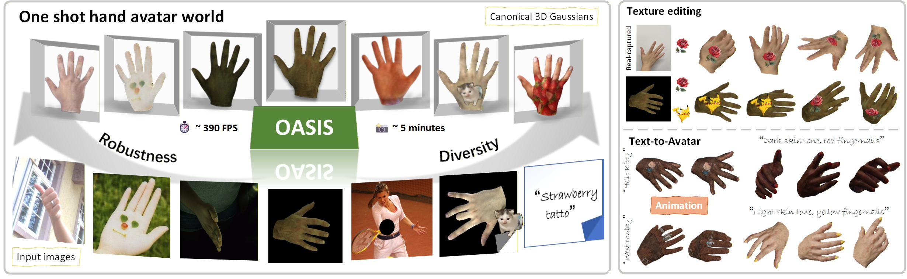
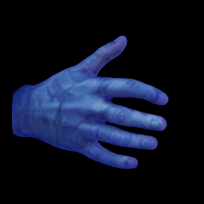
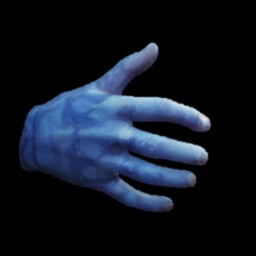

# 页面素材与字体修改说明

## 1. 替换 teaser 图

- 文件位置：`static/images/teaser.jpg`
- 页面引用位置：`index.html` 中 `<!-- Teaser image -->` 这一段
- 最简单的方式：直接用同名文件覆盖 `static/images/teaser.jpg`

如果想改成别的文件名，也可以修改 `index.html` 里的这一行：

```html

```

## 2. 替换主结构图和实验结果图

- 主结构图：`static/images/main.jpg`
- InterHand 结果图：`static/images/interhand_exp_final_2.png`
- In-the-wild 结果图：`static/images/in-the-wild-2.jpg`
- Applications 总览图：`static/images/app.jpg`

这些文件都在 `index.html` 中直接以 `` 的形式引用，搜索对应文件名即可定位。

## 3. 替换 Applications 的 9 组对比图

- 文件夹位置：`static/images/app/`
- 页面代码位置：`index.html` 中 `<!-- Applications -->` 这一段

每个卡片都有两张图：

- 底图：`comp-img-bottom`，当前显示在右侧
- 顶图：`comp-img-top-wrapper` 里的 ``，当前显示在左侧

示例：

```html
<div class="comparison-slider">
  
  <div class="comp-img-top-wrapper"></div>
</div>
```

如果你要替换某一组图片，只需要：

1. 把新图复制到 `static/images/app/`
2. 在 `index.html` 中把对应的 `src` 改成新文件名

## 4. 替换视频对比区块的素材

- 文件夹位置：`static/videos/`
- 页面代码位置：`index.html` 中 `<!-- Video comparisons -->` 这一段

当前视频区块是占位版，左右两边都支持视频：

```html
<div class="comparison-slider is-video">
  <video class="comp-img-bottom" autoplay muted loop playsinline preload="metadata">
    <source src="static/videos/carousel1.mp4" type="video/mp4">
  </video>
  <div class="comp-img-top-wrapper">
    <video autoplay muted loop playsinline preload="metadata">
      <source src="static/videos/banner_video.mp4" type="video/mp4">
    </video>
  </div>
</div>
```

替换方法：

1. 把新视频放到 `static/videos/`
2. 修改左右两边 `<source src="...">` 的路径

建议：

- 左右视频尽量分辨率一致
- 左右视频时长尽量一致
- 推荐使用 `mp4`

## 5. 修改整体字体大小

主要样式文件：`static/css/index.css`

最常用的几个位置如下：

- 全站基础字号：

```css
body {
  font-size: 16px;
}
```

- 论文大标题：

```css
.publication-title {
  font-weight: 800 !important;
}
```

如果要直接调大小，可以加上：

```css
.publication-title {
  font-size: 3rem !important;
}
```

- 二级标题，比如 `Abstract`、`Applications`：

```css
.title.is-3 {
  font-weight: 700 !important;
}
```

- 摘要正文：

```css
.content.has-text-justified {
  font-size: 1.1rem;
}

.section.hero.is-light .content.has-text-justified {
  font-size: 0.98rem;
}
```

- Applications 小标题：

```css
.app-grid-item h5 {
  font-size: 0.8rem;
}
```

- 按钮字体：

```css
.button {
  font-weight: 600 !important;
}
```

如果你想统一整体放大或缩小，优先改这几个地方：

1. `body` 的 `font-size`
2. `.publication-title`
3. `.title.is-3`
4. `.content.has-text-justified`
5. `.app-grid-item h5`

## 6. 修改对比分界线样式

对应文件：`static/css/index.css`

核心选择器：

- `.comparison-slider`
- `.comp-img-top-wrapper`
- `.comp-divider`
- `.comp-handle`
- `.comp-label`

如果你想改分界线粗细，看这里：

```css
.comparison-slider .comp-divider {
  width: 3px;
}
```

如果你想改拖拽圆点大小，看这里：

```css
.comparison-slider .comp-handle {
  width: 40px;
  height: 40px;
}
```

## 7. 修改滑块交互逻辑

对应文件：`static/js/index.js`

核心函数：

- `initComparisonSliders()`：控制拖拽分界线
- `syncComparisonVideos()`：控制左右视频同步播放/暂停/进度

如果以后你想继续扩展视频对比功能，优先看这两个函数。